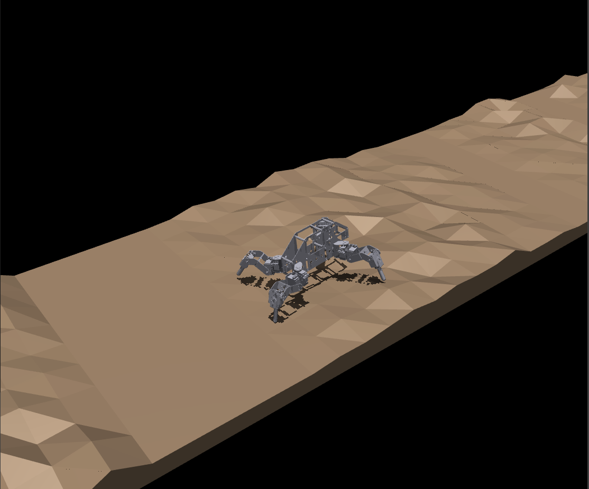

# Quadruped-Gait-EA
This repository hosts the code for evolving open-loop gait parameters of a quadruped robot in Mujoco. We have made use of a Central Pattern Generator (CPG) for our quadruped to walk on rough, uneven surfaces, and have set the parameters to be obtained by evolution. 

The robot has 3 joints per legs, and has 4 legs in total, making it a 12DoF quadruped spider robot. The robot has joint angle limits which we enforce throughout evolution. We randomly generate the terrain 10m long and 1m wide, keeping in mind the following parameters:

*    Friction Coefficient: 0.7
*    Vertical Step Height: 0 to 6cm
*    Terrain Slope: 0 deg



*Robot traversing the randomly-generated rough terrain in MuJoCo simulation.*


#### Local Ubuntu Setup

Open your terminal and run the following commands:

```bash

# Initialize and activate the virtual environment
python3 -m venv venv
source venv/bin/activate

# Install MuJoCo and parallel processing libraries
pip install mujoco numpy scipy
```

#### Repository Structure

The repository contains the following files and folders:

*   `scene.xml` is setting the world with the robot and the rough terrain testbed, and defines the friction and gravity.

*   `base_EA.py` Base class for general EA, has some abstract functions which we define in our main EA class.

*   `ea_main.py` This is the main EA class which defines the abstracts functions and has implementation related to our evolution task. We set parameters here to evolve the gait and save incremental results of the evolution.

*   `evaluator.py` This file contains functions for running two types of evolution, one in headless parallel mode and the other in visual mode for determining if the robot is spawning correctly in the terrain. We predominantly make use of the headless parallel one.

*   `cpg_core.py` The robot is commanded with position commands which come from the CPG logic contained in this file.

*   `validate_gait.py` This is one instance of the robot traversing on the terrain which we use to check the evolved parameters and generate graphs related to fitness, servo angles and torques.

*   `plotting.py` This is a script for plotting the results which are continually saved in the results folder to benchmark the performance of evolution.

*   `models/` This folder contains the model of the robot and a script `converter.py` to parse the .urdf to generate the .xml file which is read by MuJoCo. 


#### References

[1] J. Vice, G. Sukthankar, and P. K. Douglas, "Leveraging evolutionary algorithms for feasible hexapod locomotion across uneven terrain," arXiv preprint arXiv:2203.15948, 2022.

[2] J. Kim, D. X. Ba, H. Yeom, and J. Bae, "Gait optimization of a quadruped robot using evolutionary computation," Journal of Bionic Engineering, vol. 18, no. 2, pp. 306–318, 2021.

[3] W. Li, W. Chen, X. Wu, and J. Wang, "Parameter tuning of cpgs for hexapod gaits based on genetic algorithm," in Proceedings of the IEEE 10th Conference on Industrial Electronics and Applications (ICIEA), Auckland, New Zealand, 2015, pp. 45–50.

[4] G. B. Parker, "Evolving gaits for hexapod robots using cyclic genetic algorithms," International Journal of General Systems, vol. 34, no. 3, pp. 301–315, 2005.

[5] C. Mailer, G. Nitschke, and L. Raw, "Evolving gaits for damage control in a hexapod robot," in 2021 Genetic and Evolutionary Computation Conference (GECCO '21). ACM, 2021.

[6] J. Nordmoen, T. F. Nygaard, K. O. Ellefsen, and K. Glette, "Evolved embodied phase coordination enables robust quadruped robot locomotion," in Proceedings of the Genetic and Evolutionary Computation Conference (GECCO), Prague, Czech Republic, 2019, pp. 133–141.

[7] J. O'Connor, J. B. Nash, D. Gezgin, and G. B. Parker, "Scope for hexapod gait generation," in Computational Intelligence, ser. Communications in Computer and Information Science. Cham, Switzerland: Springer, 2025, vol. 2828.

[8] A. Manglik, K. Gupta, and S. Bhanot, "Adaptive gait generation for hexapod robot using genetic algorithm," in Proceedings of the 1st IEEE International Conference on Power Electronics, Intelligent Control and Energy Systems (ICPEICES), Delhi, India, 2016, pp. 1–6.

[9] A. J. Ijspeert, "Central pattern generators for locomotion control in animals and robots: A review," Neural Networks, vol. 21, no. 4, pp. 642–653, 2008.

[10] E. Todorov, T. Erez, and Y. Tassa, "Mujoco: A physics engine for model-based control," in Proceedings of the IEEE/RSJ International Conference on Intelligent Robots and Systems (IROS). IEEE, 2012, pp. 5026–5033.

